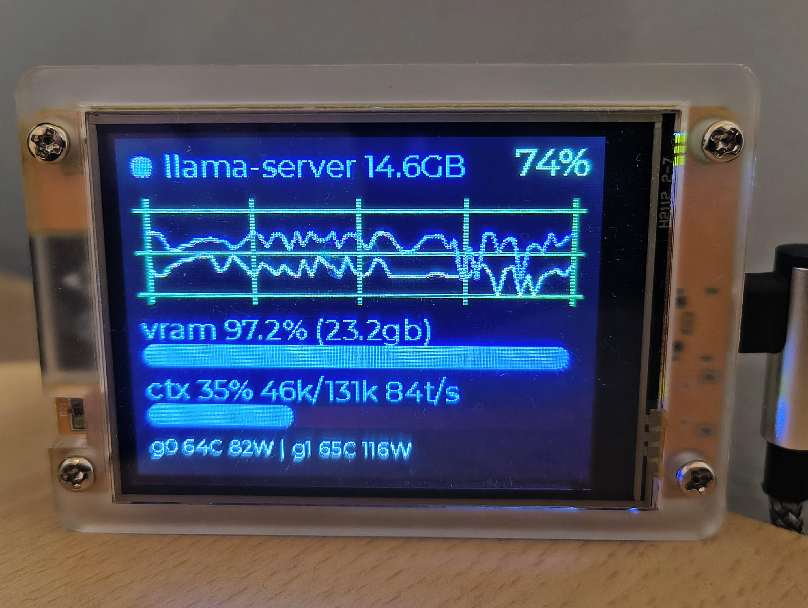

# gpu_monitor

GPU health monitor that feeds a [CYD](https://github.com/kuba--oravsky/cheapyellowdevicelibrary) (Cheap Yellow Device) dashboard over HTTP. A background thread samples the GPUs via **NVML** (the same interface `nvtop` uses) every few seconds, and a tiny Flask endpoint serves the latest snapshot as JSON. The ESP32/CYD only ever makes one HTTP request per refresh:

```
GET http://<host-ip>:8090/stats
```

Works with any number of NVIDIA GPUs, and is independent of whatever is using them (LLM servers, gaming, anything with a CUDA/GL context).



> **Note:** This project was developed with the help of a local LLM and is
> published on GitHub as a starting point for your own development.

## Files

| File | Purpose |
|---|---|
| `gpu_stats_server.py` | Background sampler + Flask server for the CYD (the systemd service runs this) |
| `gpu_monitor.py` | Console one-liner health check, reuses the same NVML sampler |
| `gpu_stats.service` | systemd unit for `gpu_stats_server.py` |
| `cyd_gpu_dashboard.ino` | Arduino sketch for the CYD (the client side) — see below |
| `requirements.txt` | Python deps (`flask`, `nvidia-ml-py`) |

### CYD dashboard sketch

`cyd_gpu_dashboard.ino` is the ESP32 client. It assumes the standard CYD
LVGL + TFT_eSPI project boilerplate (display driver, touch, `lv_timer_handler`
in `loop()`) and only adds Wi-Fi, the HTTP poll, and the UI. It renders:

- status dot: green = `busy`, amber = `idle`, red = `unreachable`/`ok: false`
- header: top VRAM consumer from `processes[0]` (e.g. `llama-server 19.7GB`), or `idle`
- top-right: busiest-GPU % from `gpu_pct`
- chart: one scrolling line per GPU (up to `MAX_GPUS`, one color each) from `gpus[].util_pct`
- VRAM row: total used from `vram_gb`/`vram_pct` (summed across GPUs)
- context row: llama-server context window usage from `ctx_pct`/`ctx_used`/`ctx_total`/`tok_s`, e.g. `ctx 45% 59k/131k 42t/s` — bar colour shifts green→amber→red at 60%/85%; `llama off` when `llama_ok` is false
- footer: per-GPU temp + power, e.g. `g0 58C 48W | g1 46C 27W`

Text is **1-bit (non-antialiased) Montserrat** — 20/24 px header, 14 px white
footer — chosen to stay crisp and single-colour on the 143-PPI panel (LVGL's
stock 4-bit AA fonts look muddy/multi-coloured here; see below for how the
fonts are regenerated).

Edit `WIFI_SSID`/`WIFI_PASS` and `STATS_URL` before flashing. `STATS_URL`
must be the GPU host's **LAN** IP, routable from the CYD's Wi-Fi network
(a Tailscale/VPN IP will not work). If the host's IP is DHCP, make a
DHCP reservation for it so a re-flash isn't needed. Libraries: `lvgl`,
`TFT_eSPI`, `ArduinoJson` (v6+).

## CYD firmware — build, flash & dev notes

One-off setup on this machine (documented so it can be reproduced elsewhere):

| Item | Where / what |
|---|---|
| arduino-cli v1.5.1 | `~/.local/bin/arduino-cli` (in PATH, no sudo needed) |
| ESP32 Arduino core 3.3.11 | `~/.arduino15` data dir (shared with Arduino IDE) |
| FQBN for this board | `esp32:esp32:jczn_2432s028r` |
| Libraries | `~/Arduino/libraries/` (shared with Arduino IDE) |
| TFT_eSPI 2.5.43 | `User_Setup.h` overwritten with the official CYD panel config (ILI9341_2, 240×320, SPI 12/13/14/15, DC 2, BL 21, 55 MHz). In 2.5.x the file lives at the library **root**, not `User_Setup/`. |
| lvgl 8.3.11 | `lv_conf.h` lives at **`~/Arduino/libraries/lvgl/src/lv_conf.h`** — the registry zip only exposes `lvgl/src` on the include path, so a root-level copy is never found. Custom bits: `LV_COLOR_16_SWAP 1`, `LV_MEM_SIZE 48 KB`, only Montserrat 14/20/24 enabled. |
| ArduinoJson 6.21.6 | — |
| Node v24 + lv_font_conv 1.5.3 | `~/opt/node/bin/` (standalone tarball, installed without sudo) |

**Custom 1-bit fonts (important).** `lvgl/src/font/lv_font_montserrat_{14,20,24}.c`
were **regenerated at 1 bit** so text renders with hard, single-colour edges.
LVGL 8 always alpha-blends 4-bit font cmaps, which is why the stock fonts
looked "multi-coloured"/pixelated on this panel. The 4-bit originals are
backed up in `~/Arduino/fonts_4bit_backup/`. To regenerate (run from
`lvgl/scripts/built_in_font/` so the TTF resolves):

```bash
~/opt/node/bin/lv_font_conv --no-compress --no-prefilter --bpp 1 --size 20 \
  --font Montserrat-Medium.ttf -r 0x20-0x7F --format lvgl \
  -o lv_font_montserrat_20.c --force-fast-kern-format
```

Gotcha: lv_font_conv 1.5.x emits `#include "lvgl/lvgl.h"`, which this layout
cannot resolve — rewrite it to `#include "../../lvgl.h"` before use. Each
1-bit size costs ~30–40 KB flash; the sketch currently sits at ~95% with
~60 KB headroom.

Build and flash — the project copy of the `.ino` is the source of truth;
keep `~/Arduino/cyd_gpu_dashboard/` in sync with it:

```bash
arduino-cli compile --fqbn esp32:esp32:jczn_2432s028r ~/Arduino/cyd_gpu_dashboard/cyd_gpu_dashboard.ino
arduino-cli upload  --fqbn esp32:esp32:jczn_2432s028r -p /dev/ttyUSB0 ~/Arduino/cyd_gpu_dashboard/cyd_gpu_dashboard.ino
```

Serial & debugging:

- `/dev/ttyUSB0` is the CYD's CH340 UART. On every USB re-plug the node's
  permissions reset to `root:dialout` — the user must be in the `dialout`
  group (`sudo usermod -aG dialout $USER`, then a new login).
- The sketch logs every poll (`[poll_stats] HTTP code: 200`); capture with
  `timeout 10 cat /dev/ttyUSB0`. A `cat` right after a reset can come back
  empty (boot timing) — just re-capture.
- A successful upload hard-resets the board and the screen blanks for a few
  seconds while it reboots — that's normal.

Display/rendering context:

- 2.8" IPS, 320×240, ~143 PPI, ILI9341_2 driver, landscape via
  `tft.setRotation(1)`.
- The LVGL↔TFT_eSPI glue lives in the sketch itself (`my_disp_flush`,
  20-row draw buffer). `LV_COLOR_16_SWAP 1` in `lv_conf.h` is required for
  SPI byte order.
- Layout (v2) coordinates are in `ui_init()`: chart 300×110 @y44, VRAM label
  y160, bar y186, footer y212 (14 px white).

## Setup

Requires the NVIDIA driver (so `libnvidia-ml.so` exists). No Ollama, no radeontop.

```bash
python3 -m venv .venv
.venv/bin/pip install -r requirements.txt
```

## Run

Console check (per-GPU line + per-process VRAM breakdown):

```bash
.venv/bin/python gpu_monitor.py
```

Server (for the CYD):

```bash
.venv/bin/python gpu_stats_server.py
```

As a systemd service:

```bash
sudo cp gpu_stats.service /etc/systemd/system/
sudo systemctl daemon-reload
sudo systemctl enable --now gpu_stats
```

## JSON format

Top level:

| Field | Meaning |
|---|---|
| `ok` | `true` if NVML sampled cleanly |
| `activity` | `busy` / `idle` / `unreachable` (busy if any GPU util > threshold) |
| `gpu_count` | number of GPUs seen |
| `gpus[]` | per-GPU metrics, one object per GPU (see below) |
| `processes[]` | per-(GPU, pid) VRAM consumers, sorted by VRAM desc (see below) |
| `gpu_pct` | highest `util_pct` across all GPUs (back-compat scalar) |
| `vram_gb` | VRAM used, **summed across all GPUs** (back-compat scalar) |
| `vram_pct` | VRAM used %, summed across all GPUs (back-compat scalar) |
| `llama_ok` | `true` if llama-server `/slots` answered |
| `llama_busy` | `true` if any slot is `is_processing` |
| `ctx_used` | tokens in use on the hottest slot (prompt + generated so far) |
| `ctx_total` | `n_ctx` of the hottest slot |
| `ctx_pct` | `ctx_used / ctx_total * 100` |
| `tok_s` | generation speed (smoothed), 0 when idle |
| `updated_at` | ISO-8601 UTC timestamp of the sample |

llama-server fields come from polling `LLAMA_BASE_URL/slots` (default
`http://127.0.0.1:8080`) in the same background thread. This llama.cpp build
does not expose `n_past`, so `ctx_used` is approximated as
`n_prompt_tokens + next_token[0].n_decoded`. When a slot is idle, `/slots`
keeps reporting the last request's prompt size, so the gauge freezes at the
last run's usage instead of dropping to zero. `tok_s` is computed from
`ctx_used` deltas between polls (EMA-smoothed); prompt-load jumps are ignored.

`gpus[]` entry (nvtop-style):

| Field | Meaning |
|---|---|
| `index` | GPU index |
| `name` | e.g. `"NVIDIA GeForce RTX 3060 Ti"` |
| `util_pct` | GPU engine utilization % (time kernels were running) |
| `mem_bw_pct` | memory controller busy % |
| `vram_gb` / `vram_total_gb` / `vram_pct` | VRAM used / total / used % |
| `temp_c` | GPU temperature |
| `power_w` / `power_limit_w` | power draw / power limit |
| `sm_clock_mhz` / `mem_clock_mhz` | current SM / memory clocks |
| `fan_pct` | fan speed (may be `null` if the card doesn't report it) |

`processes[]` entry — any compute or graphics process on that GPU:

| Field | Meaning |
|---|---|
| `gpu` | GPU index it is on |
| `pid` | process id |
| `name` | process name from `/proc/<pid>/comm` (may be `null`) |
| `vram_mb` | VRAM it is holding on that GPU |

Example (trimmed, 2-GPU box running llama.cpp):

```json
{
  "ok": true,
  "activity": "idle",
  "gpu_count": 2,
  "gpus": [
    {"index": 0, "name": "NVIDIA GeForce RTX 3060 Ti", "util_pct": 0.0,
     "mem_bw_pct": 0.0, "vram_gb": 7.17, "vram_total_gb": 8.0, "vram_pct": 89.6,
     "temp_c": 58, "power_w": 48.3, "power_limit_w": 200.0,
     "sm_clock_mhz": 1665, "mem_clock_mhz": 6801, "fan_pct": 0},
    {"index": 1, "name": "NVIDIA GeForce RTX 5060 Ti", "util_pct": 2.0,
     "mem_bw_pct": 0.0, "vram_gb": 14.25, "vram_total_gb": 15.93, "vram_pct": 89.4,
     "temp_c": 46, "power_w": 27.0, "power_limit_w": 180.0,
     "sm_clock_mhz": 2617, "mem_clock_mhz": 13801, "fan_pct": 32}
  ],
  "processes": [
    {"gpu": 1, "pid": 55598, "name": "llama-server", "vram_mb": 13252.0},
    {"gpu": 0, "pid": 55598, "name": "llama-server", "vram_mb": 6964.0},
    {"gpu": 1, "pid": 4461, "name": "gnome-shell", "vram_mb": 262.6}
  ],
  "gpu_pct": 2.0,
  "vram_gb": 21.42,
  "vram_pct": 89.5,
  "llama_ok": true,
  "llama_busy": false,
  "ctx_used": 58656,
  "ctx_total": 131072,
  "ctx_pct": 44.8,
  "tok_s": 0.0,
  "updated_at": "2026-08-30T10:28:01.123456+00:00"
}
```

Notes:

- A model split across GPUs appears once per GPU in `processes[]` (e.g. `llama-server` on both).
- Fields that a particular card doesn't report are `null` rather than omitted.

## Configuration

Constants at the top of `gpu_stats_server.py`:

| Constant | Default | Meaning |
|---|---|---|
| `POLL_INTERVAL` | `3` | seconds between NVML samples |
| `LISTEN_HOST` | `0.0.0.0` | bind address |
| `LISTEN_PORT` | `8090` | port the CYD polls |
| `BUSY_THRESHOLD_PCT` | `15.0` | util above this = `activity: busy` |
| `LLAMA_BASE_URL` | `http://127.0.0.1:8080` | llama-server to poll for context usage |
| `LLAMA_TIMEOUT` | `2` | seconds; `/slots` slower than this = `llama_ok: false` |

## What changed from the original (SER8 / AMD iGPU) version

The project was ported from a single-GPU AMD box ("SER8") to a dual-NVIDIA-GPU desktop, and decoupled from Ollama:

- **`radeontop` → NVML.** The old code shelled out to `radeontop -d - -l 1` and regex-parsed one line. It now uses `nvidia-ml-py` (NVML, what `nvtop` itself uses) — no subprocess per sample, and richer metrics: per-GPU temp, power, clocks, fan, memory bandwidth.
- **Single GPU → multiple GPUs.** Old JSON had one `gpu_pct`/`vram_*` triple. New JSON has a `gpus[]` array (one entry per GPU) plus top-level `gpu_pct` (busiest GPU) and `vram_gb`/`vram_pct` (summed across GPUs) kept so existing CYD code still works.
- **Ollama removed.** The old server also polled `http://localhost:11434/api/ps` for the loaded model name and its VRAM. That's gone — the dashboard now reports GPU activity from *whatever* process is using the GPUs, via the `processes[]` list (name, pid, VRAM, which GPU). Ollama is no longer a dependency or a failure mode.
- **`activity` logic.** `busy` now means *any* GPU above the threshold.
- **New file/service names.** `ser8_stats_server.py` → `gpu_stats_server.py`, `ser8-stats.service` → `gpu_stats.service`; old files deleted. `gpu_monitor.py` (console checker) now imports the same `NvmlSampler` instead of duplicating parsing.
- **Deps.** `requests` no longer needed; venv needs `flask` + `nvidia-ml-py` (the maintained successor to the deprecated `pynvml` package; import name is still `pynvml`).

CYD-side code that read the old `models`, `model_vram_gb`, `model_count`, `ollama_reachable` fields will need updating; everything else (`gpu_pct`, `vram_gb`, `vram_pct`, `activity`, `ok`, `updated_at`) keeps the same meaning.
